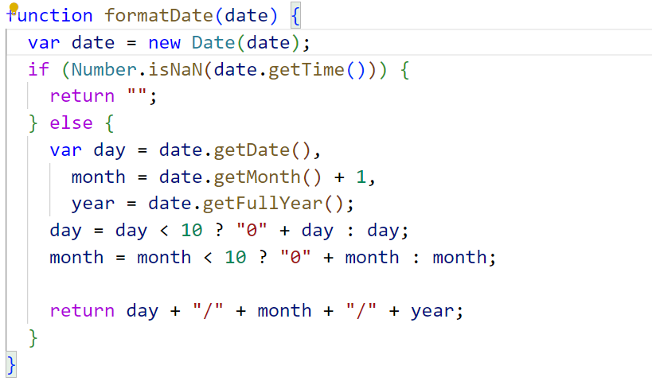
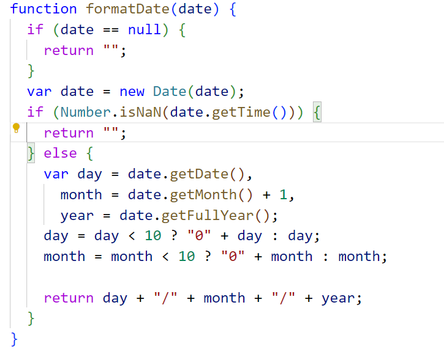

# Ngày sinh

## Báo cáo mô tả luồng

- Trên giao diện, chọn chức năng import file excel vào chọn file Danh sách nhân viên
- API gọi đến hàm UploadImportFile() (ImportEmployeeController)
- Gọi đến ReadEmployeeDataFromExcel() (ImportEmployeeService), đọc dữ liệu từ tệp đã tải lên trả về danh sách nhân viên đọc được trong file
- Service gọi GetEmployeesFromDatabase để lấy thông tin nhân viên đã có trong database để check trùng
- ImportEmployeeRepository gọi GetEmployees()
- CommonUitility gọi GetCurrentOrganization() để lấy ra thông tin tổ chức
  - Đọc Id của tổ chức từ session
  - Nếu đọc Id thành công, truy vấn cơ sở dữ liệu để lấy ra thông tin tổ chức
  - Ngược lại trả về null
    => Hàm GetCurrentOrganizationId() trả về Id đúng của MISA hoặc null
- Hàm GetEmployees() ở ImportEmployeeRepository trả về danh sách các nhân viên ở MISA trong database (trả về 0 nhân viên vì database trống)
-
- Dữ liệu nhân viên trong database trả về null vì trong database không có
- Gọi ReadDataFromExcel() ở BaseImportService:

  - Kiểm tra xem file có null không (Guard.Against.NullFile(importFile);)
  - Lấy thông tin tệp nhập khẩu (TableName: "Employee", ImportTableName: "Nhập khẩu nhân viên") => Gọi đến hàm GetFileImportInfo() ở BaseImportRepository lấy thông tin nhập khẩu từ database dựa theo fileImpportSpec
  - Kiểm tra định dạng file có phải file theo Template đã chỉ định hay không => Gọi đến hàm FileExtensionInvalid() ở ImportGuardExtension
    (+) Lấy ra chuỗi mở rộng
    (+) Nếu file không đúng định dạng: ErrorHandlingMiddleware được gọid để xử lý lỗi => trả về MISACode là 500
    (+) Nếu file đúng đúng định dạng: Tiếp tục xử lý
  - Khi file đầu vào đã đúng định dạng: đọc dữ liệu từ file sử dụng thư viện ExcelPackage => gọi đến hàm BuildListDataFromExcel() ở BaseImportService

  * Chạy hàm BuildListDataFromExcel() ở BaseImportService:
    - Duyệt qua từng sheet trong file nhập khẩu
    - Kiểm tra sheet có đúng định dạng sheet nhập khẩu hay không (có ít nhất 1 sheet khai báo thông tin)
    - Kiểm tra Worksheet có giống File mẫu hay không
    - Bỏ qua các sheet ẩn, không nhập khẩu, không khai báo bảng dữ liệu sẽ lưu trong database
    - Duyệt từng cột trong sheet, kiểm tra tên cột đã hợp lệ hay chưa (sau khi đã loại bỏ dấu câu tiếng Việt nhờ hàm RemoveDiacritics() ở BaseImportService)
    - Duyệt từng dòng trong sheet, mapping các giá trị nhờ hàm BuildObject() ở BaseImportService
      - Hàm BuildObject() ở BaseImportService:
        - Đọc lần lượt dữ liệu ở từng cột, mapping lần lượt từng trường thông tin
        - Bỏ qua các cột không được khai báo trong database
        - Kiểm tra giá trị trong bảng là hợp lệ về định dạng
        - Kiểm tra trùng dữ liệu bằng hàm CheckDuplicateData() ở BaseImportService
        - Mapping dữ liệu bằng hàm ProcessCellValueByDataType() ở BaseImportService
        - Bỏ qua các ô không có thông tin mapping được khai báo, không có property tương ứng
        - Chuyển đổi kiểu ulong đúng kiểu dữ liệu
    - Gán Id tổ chức cho dữ liệu đọc được
    - Xử lý với các dạng EmployeeFamily và EmployeeMaster
      => Hàm BuildListDataFromExcel() trả về thông tin nhân viên được nhập khẩu

  - Các dữ liệu đầu vào, và dữ liệu vị trí mới được lưu vào cache
  - Trả về response cho người dùng

- Lỗi là do hàm formatDate ở FE chưa kiểm tra điều kiện null
- Cách sửa lỗi:
- Hàm ban đầu:

- Hàm sau khi sửa: thêm kiểm tra điều kiện null

